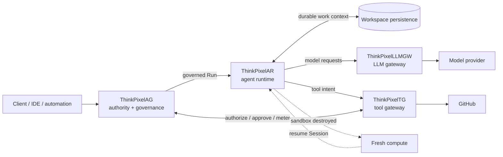
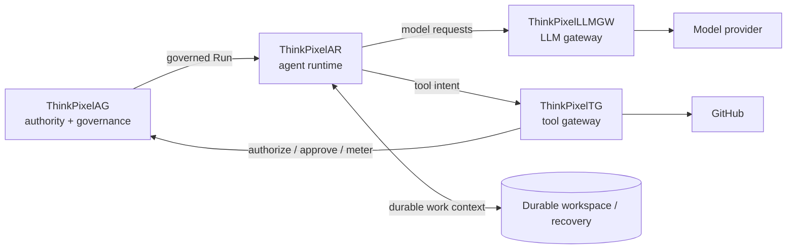

# ThinkPixel

**Infrastructure for running untrusted AI agents without giving the agent the keys to the kingdom.**

ThinkPixel is a family of independently deployable components for building governed AI-agent systems.

The central idea is simple:

> **Agents are not the authority.**

Authority, long-lived credentials, durable state, policy enforcement, and evidence live outside the agent execution boundary. Agent compute should be disposable. Model access and external side effects should pass through governed infrastructure.

ThinkPixel does **not** prescribe how an agent plans, reasons, or loops. Agent harnesses are replaceable. ThinkPixel owns the infrastructure around them: delegated authority, isolated execution, durable work, model access, tool access, credentials, evidence, and lifecycle.

> **Status:** ThinkPixel is under active pre-1.0 development. Individual components range from contract/design work to release candidates. The complete platform is **not currently presented as a production-qualified integrated system**.

---

## Current goal

The immediate goal is not to make every ThinkPixel repository independently complete.

It is to prove one useful vertical slice end to end:

> Give an approved Codex agent a GitHub repository, run it in isolated disposable compute, route model access through ThinkPixelLLMGW, route a governed GitHub operation through ThinkPixelTG, destroy the execution sandbox completely, reconstruct execution on fresh compute, and continue the same durable session/workspace under ThinkPixelAG authority.

The demo should make six properties visible:

**Agents are untrusted.
Authority is external.
Credentials are external.
Compute is disposable.
State is durable.
Side effects are governed.**

The architecture should be demonstrated by a running system, not merely described by a diagram.

---

## The current critical path



For the first integrated slice, the critical components are:

| Component                             | Responsibility                                                                   | Current role                                                                   |
| ------------------------------------- | -------------------------------------------------------------------------------- | ------------------------------------------------------------------------------ |
| [ThinkPixelAG](../ThinkPixelAG)       | Run authority, governance, policy, approvals, revocation, resource envelopes     | **Required** — authority/control plane                                         |
| [ThinkPixelAR](../ThinkPixelAR)       | Disposable agent execution, Sessions, harness adaptation, recovery               | **Required** — primary critical path                                           |
| [ThinkPixelLLMGW](../ThinkPixelLLMGW) | Governed model access, provider abstraction, credentials, budgets and accounting | **Required** — one real model path                                             |
| [ThinkPixelTG](../ThinkPixelTG)       | Governed tool execution, downstream credentials, side effects and evidence       | **Required** — one real GitHub operation                                       |
| [ThinkPixelWS](../ThinkPixelWS)       | Durable roaming work context                                                     | **Minimal support** — only enough durable workspace behavior to prove recovery |

The first slice intentionally does **not** require every planned platform capability.

---

## What the golden path should prove

A successful demonstration should be able to show this sequence:

1. ThinkPixelAG authorizes a governed Run.
2. ThinkPixelAR starts a real Codex harness inside isolated compute.
3. The agent interacts with a model through ThinkPixelLLMGW rather than receiving model credentials directly.
4. Work survives outside the disposable execution sandbox.
5. At least one visible GitHub side effect passes through ThinkPixelTG.
6. The agent never receives the long-lived GitHub credential used for that operation.
7. The execution sandbox is destroyed completely.
8. Fresh compute is created and the same logical Session/workspace is reconstructed.
9. Execution continues with stable platform identity and observable evidence linking the resumed work to its governing authority.

A narrow but real implementation is preferable to a broad simulated one.

For the first release-candidate path, it is acceptable to support only:

* one harness;
* one sandbox implementation;
* one Kubernetes/runtime configuration;
* one model-provider route;
* one tool connector;
* one persistence strategy;
* one scripted golden-path scenario.

Broader compatibility comes after the vertical slice is reproducible.

---

## ThinkPixel is not an agent framework

ThinkPixel does not attempt to own the agent reasoning loop.

Codex, Claude Code, custom agents, future agent harnesses, or other orchestration systems should be able to run inside the execution boundary without becoming the authority for the system around them.

ThinkPixel is concerned with questions such as:

* Who authorized this agent to run?
* What resources may it consume?
* Which model may it access?
* Which credentials may indirectly be used on its behalf?
* Which external side effects are allowed?
* Where does durable work survive when compute disappears?
* What evidence proves what happened?
* How can authority be revoked without trusting the agent to cooperate?

Agent implementations should be replaceable without moving these responsibilities into the agent itself.

---

## Design principles

### Agent intent is not authority

An agent may request an operation. That does not make the operation authorized.

Policy decisions and enforceable authority belong outside the agent execution environment.

### Credentials stay outside the sandbox

Long-lived provider, GitHub, cloud, and enterprise credentials should not need to be handed to arbitrary agent code.

Gateways perform privileged operations on behalf of appropriately authorized workloads.

### Compute is disposable

An execution environment should be destroyable without destroying the logical agent Session or its governed work.

Recovery onto replacement compute is a normal lifecycle operation, not an exceptional disaster-recovery mechanism.

### Durable state has explicit owners

Runtime state, workspace state, memory, governance state, evidence, and artifact metadata should not silently collapse into one database owned by an agent runtime.

### Side effects are governed

External actions should cross an enforcement boundary where identity, authorization, credentials, idempotency, policy, and evidence can be handled explicitly.

### Components remain replaceable

ThinkPixel is deliberately decomposed around ownership and security boundaries rather than around the goal of accumulating services.

A component exists because it owns a meaningful boundary, not merely because the architecture has room for another service.

---

## Platform components

The full architecture contains components beyond the current critical path.

### Core integration path

| Component                             | Role                                     | Maturity         |
| ------------------------------------- | ---------------------------------------- | ---------------- |
| [ThinkPixelAG](../ThinkPixelAG)       | Agent governance and lifecycle authority | `rc`             |
| [ThinkPixelAR](../ThinkPixelAR)       | Agent runtime and disposable execution   | `implementation` |
| [ThinkPixelLLMGW](../ThinkPixelLLMGW) | Governed LLM access                      | `rc`             |
| [ThinkPixelTG](../ThinkPixelTG)       | Governed tool execution                  | `implementation` |

### Supporting platform components

| Component                         | Role                                  | Current relationship to the first slice                        |
| --------------------------------- | ------------------------------------- | -------------------------------------------------------------- |
| [ThinkPixelWS](../ThinkPixelWS)   | Durable roaming Workspaces            | Minimal persistence/recovery capability required               |
| [ThinkPixelMP](../ThinkPixelMP)   | Marketplace and software supply chain | Deferred; immutable artifacts may initially be pinned directly |
| [ThinkPixelMEM](../ThinkPixelMEM) | Governed long-term agent memory       | Deferred                                                       |
| [ThinkPixelGR](../ThinkPixelGR)   | Guardrail evaluation                  | Deferred unless required by a concrete demonstrated path       |
| [ThinkPixelXP](../ThinkPixelXP)   | Experimentation and evaluation        | Deferred until stable executions exist to compare              |

### Adjacent / integration boundary TBD

| Component                             | Role                                             | Status                                                                                    |
| ------------------------------------- | ------------------------------------------------ | ----------------------------------------------------------------------------------------- |
| [ThinkPixelInfra](../ThinkPixelInfra) | Existing search / retrieval / RAG implementation | Standalone; its eventual boundary with the agent platform remains intentionally undefined |

The platform does not force a component into the critical path merely because an AI platform is expected to have that capability.

---

## Component maturity

ThinkPixel uses a small common maturity vocabulary for ecosystem-level reporting:


These values describe **engineering maturity**, not importance.

They also do not imply that all components advance in lockstep.

For example, a component can be individually mature while the platform-level path that consumes it is still incomplete.

The canonical machine-readable component catalog is:

[`catalog/components.yaml`](catalog/components.yaml)

Individual component repositories remain the source of truth for their detailed implementation status.

---

## Platform integration status

Component maturity and platform integration are intentionally separate.

The current platform priority is:



Other components should be integrated when a demonstrated capability requires them, rather than because their repositories exist.

See [`docs/development/ALIGNMENT.md`](docs/development/ALIGNMENT.md) for the current cross-repository development priority.

---

## Releases and compatibility

ThinkPixel components are independently versioned.

A ThinkPixel **platform release** therefore does not mean every repository shares the same version.

Instead, a platform release is a tested manifest containing:

* exact component revisions;
* required runtime or artifact revisions;
* the environment in which they were exercised;
* verified end-to-end scenarios;
* known limitations;
* evidence or reproduction instructions.

A platform manifest represents a **known tested combination**, not a blanket claim that arbitrary component versions are mutually compatible.

See [`releases/README.md`](releases/README.md).

---

## Repository purpose

This repository is the umbrella and metadata repository for the ThinkPixel ecosystem.

Implementation belongs in the individual component repositories.

This repository owns:

* ecosystem architecture and component ownership;
* the machine-readable component catalog;
* cross-component development priorities;
* platform release and compatibility manifests;
* end-to-end integration scenarios;
* platform-level milestones;
* decisions spanning more than one component.

It should **not** become another implementation service.

Component-specific APIs, deployment instructions, security details, implementation plans, and issue tracking belong in the corresponding component repository.

---

## Repository layout

```text
.
├── catalog/
│   └── components.yaml
├── docs/
│   └── development/
│       ├── AGENTS.md
│       └── ALIGNMENT.md
├── releases/
│   └── README.md
├── LICENSE
└── README.md
```

Future additions may include schemas and generated views of the metadata:

```text
schemas/
  component.schema.json
  release.schema.json
```

The intention is for human-readable documentation to increasingly be generated or validated against the machine-readable metadata rather than allowing the two to drift independently.

---

## Development

For cross-repository work, start with:

* [`docs/development/ALIGNMENT.md`](docs/development/ALIGNMENT.md) — current platform objective, critical path, and definition of the integrated demo/RC.
* [`docs/development/AGENTS.md`](docs/development/AGENTS.md) — shared guidance for development agents and coding harnesses working across the ecosystem.
* [`catalog/components.yaml`](catalog/components.yaml) — canonical ecosystem component metadata.
* [`releases/README.md`](releases/README.md) — platform release and compatibility model.

The development rule is intentionally simple:

> **Prefer work that makes the current end-to-end path move over work that makes an isolated repository look complete.**

Once a vertical slice works reproducibly, package it, document it, pin it, and release it before broadening the architecture.

---

## Vendor neutrality

ThinkPixel's **interfaces and ownership boundaries** are intended to remain vendor-neutral.

The first reference integration intentionally uses concrete technologies — including Codex, Kubernetes/Kata, and GitHub — because proving one real path is more useful than claiming universal compatibility before it has been exercised.

Additional harnesses, runtimes, providers, and tool systems should be introduced behind the same boundaries as concrete use cases require them.

---

## License

This repository is licensed under the Apache License 2.0.

Individual ThinkPixel repositories carry their own licensing metadata and should be checked independently.
