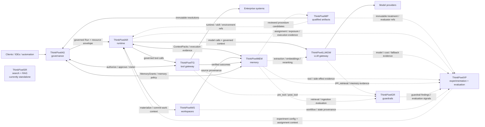

# ThinkPixel

**Modular, vendor-neutral infrastructure for governed AI agents.**

ThinkPixel is a family of independently deployable components for building AI-agent systems with explicit boundaries between **governance, execution, durable state, memory, model access, tool access, guardrails, software supply chain, and experimentation**.

This repository is the map of the ThinkPixel ecosystem. It tracks component maturity, cross-component integration, architecture, and end-to-end use cases. Implementation lives in the individual repositories.

> **Design principle:** agents and models are not the authority. Authority, durable state, credentials, policy enforcement, and evidence live outside the agent execution boundary.

## Components

*Status snapshot: 2026-09-24. Individual repositories are the source of truth.*

| Component                                                      | Role                                                                                                                                                                                      | Current status                                                                                                         |
| -------------------------------------------------------------- | ----------------------------------------------------------------------------------------------------------------------------------------------------------------------------------------- | ---------------------------------------------------------------------------------------------------------------------- |
| [ThinkPixelAG](https://github.com/bdobrica/ThinkPixelAG)       | Agent governance and lifecycle control plane: agent/run authority, policy decisions, resource envelopes, approvals, revocation, and governance state.                                     | `0.1.0-rc.2` integration candidate; broader production qualification remains incomplete.                               |
| [ThinkPixelAR](https://github.com/bdobrica/ThinkPixelAR)       | Agent runtime: durable Sessions, isolated/disposable execution, harness adaptation, recovery, and runtime events.                                                                         | Architecture, persistence, and Kubernetes/Kata foundations implemented; runtime integration remains under development. |
| [ThinkPixelWS](https://github.com/bdobrica/ThinkPixelWS)       | Durable roaming Workspaces: persistent work context, immutable generations, materializations, snapshots, forks, and source provenance.                                                    | Architecture and contracts complete; service implementation not yet started.                                           |
| [ThinkPixelMEM](https://github.com/bdobrica/ThinkPixelMEM)     | Long-term agent memory: governed learned context, provenance, temporal revisions, retrieval, correction, and forgetting.                                                                  | Contract-first bootstrap complete; service implementation not yet started.                                             |
| [ThinkPixelMP](https://github.com/bdobrica/ThinkPixelMP)       | Marketplace and software supply-chain plane for Skills, runtimes, MCP servers, agent bundles, and other immutable artifacts.                                                              | Active implementation.                                                                                                 |
| [ThinkPixelTG](https://github.com/bdobrica/ThinkPixelTG)       | Tool gateway and enforcement point for governed tool calls, downstream credentials, side effects, idempotency, and evidence.                                                              | Phases 0–3 implemented; later-phase interfaces remain under development.                                               |
| [ThinkPixelLLMGW](https://github.com/bdobrica/ThinkPixelLLMGW) | LLM gateway for provider abstraction, model routing, credentials, budgets, accounting, and model-access policy.                                                                           | Chat Completions release candidate; OpenAI, Vertex AI, and Bedrock paths implemented; not yet production-qualified.    |
| [ThinkPixelGR](https://github.com/bdobrica/ThinkPixelGR)       | Guardrails evaluator for model, tool, retrieval, and ingestion content. Returns findings and decisions for callers to enforce.                                                            | Runnable deterministic evaluation slice available; additional adapters and production deployment remain planned.       |
| [ThinkPixelXP](https://github.com/bdobrica/ThinkPixelXP)       | Experimentation and evaluation plane for immutable pipeline variants, assignment, exposure/outcome evidence, offline/shadow evaluation, controlled experiments, and statistical analysis. | Active implementation with initial analytics, statistics, storage, and safety controls available.                      |
| [ThinkPixelSR](https://github.com/bdobrica/ThinkPixelInfra)    | Search and retrieval/RAG service combining embedding-based retrieval with search infrastructure. Currently hosted as `ThinkPixelInfra`.                                                   | Existing standalone implementation; integration with the wider ThinkPixel architecture is still to be defined.         |

Component maturity is intentionally independent: ThinkPixel is not currently presented as a single production-ready integrated platform.

## Architecture

`ThinkPixelSR` is intentionally shown without an integration edge for now. Its eventual boundary with the agent platform should be defined rather than assumed.

## Integration tracker

These track **end-to-end integration**, not implementation progress inside each repository.

* [ ] **AG → AR** — governed Run admission through disposable runtime execution
* [ ] **AR ↔ WS** — durable Workspace materialization, commit, recovery, and roaming
* [ ] **AR → LLMGW → GR** — governed model-access path with guardrail evaluation
* [ ] **AR → TG ↔ AG → GR** — governed tool execution with authorization and guardrails
* [ ] **AR / WS / TG ↔ MEM** — evidence-backed memory extraction and governed retrieval
* [ ] **MP → AG / AR** — immutable qualified artifact resolution into governed execution
* [ ] **XP ↔ runtime stack** — assignment, exposure, execution evidence, outcomes, and analysis
* [ ] **SR integration** — define the search/retrieval boundary within the wider platform

An item should be checked only after the path is demonstrated across the relevant independently deployed components.

## Use cases

| Use case | Components | Status |
|---|---|---|
| [Hybrid WordPress Search](docs/use-cases/wordpress-hybrid-search.md) | ThinkPixelSR | Existing / standalone |

Additional end-to-end use cases will be added as cross-component integrations become operational.

## Repository scope

Use this repository for:

* ecosystem architecture and component ownership;
* cross-repository integration status;
* platform-level milestones and compatibility;
* end-to-end use cases and demonstrations;
* decisions that affect more than one ThinkPixel component.

Component-specific implementation issues, plans, APIs, deployment instructions, and security details belong in the corresponding component repository.

## Development

Cross-repository development guidance lives in [`docs/development/`](docs/development/).

Start with:

* [`ALIGNMENT.md`](docs/development/ALIGNMENT.md) — current platform-level priorities, demo/RC target, and critical path.
* [`AGENTS.md`](docs/development/AGENTS.md) — shared guidance for coding agents and development harnesses working across ThinkPixel repositories.

The goal is to keep component work aligned around demonstrable end-to-end capabilities rather than independent repository completeness.

---

ThinkPixel is under active development. Interfaces and component boundaries are being designed so that individual services remain independently deployable and replaceable rather than becoming a distributed monolith.
