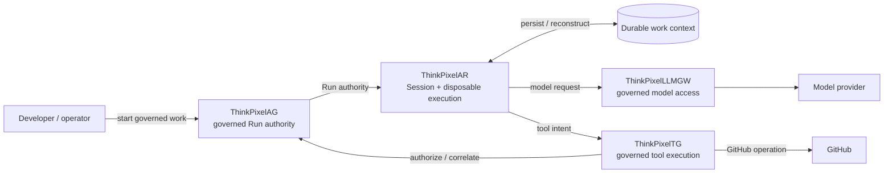
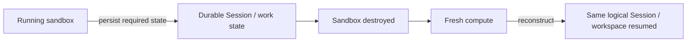
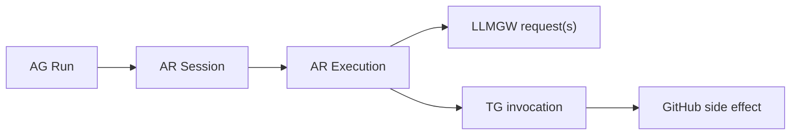

# ThinkPixel Development Alignment

This document defines the **current cross-repository development objective** for ThinkPixel.

It answers one question:

> **What should the platform prove next?**

It controls development priority, not architectural truth.

Published contracts, accepted ADRs, security boundaries, and component ownership remain authoritative within their respective scopes.

For permanent platform context, see the root [`README.md`](../../README.md).

For component metadata, see [`catalog/components.yaml`](../../catalog/components.yaml).

For platform release semantics, see [`releases/README.md`](../../releases/README.md).

---

## Current objective

Build one reproducible vertical slice demonstrating that ThinkPixel can run a useful coding agent while keeping **authority, credentials, durable work, and governed side effects outside disposable agent compute**.

The target scenario is:

> Give an approved Codex agent a GitHub repository, execute it inside isolated disposable compute, route model access through ThinkPixelLLMGW, route a visible GitHub operation through ThinkPixelTG, destroy the execution sandbox completely, reconstruct execution on fresh compute, and continue the same logical Session/workspace under ThinkPixelAG authority.

The objective is not broad feature coverage.

The objective is to make the architecture **observable through a real working system**.

---

## What the demo must make visible

The scenario should visibly demonstrate six properties:

1. **Agents are untrusted.**
2. **Authority is external.**
3. **Credentials are external.**
4. **Compute is disposable.**
5. **State is durable.**
6. **Side effects are governed.**

If a shortcut makes one of these claims false, it is not an acceptable shortcut.

---

## Golden path

The recovery portion must be real:

The original execution environment must actually disappear.

Restarting the same process or pretending that sandbox loss occurred does not prove the intended property.

---

## Critical path

### 1. ThinkPixelAR — primary implementation path

AR should receive the majority of implementation effort until the complete scenario works.

The next meaningful capabilities are:

* start, stop, and supervise a real Codex harness through the intended runtime path;
* execute Codex inside the real sandbox boundary;
* create a durable logical Session and concrete Execution;
* expose enough observable runtime events to understand what is happening;
* persist the state required for continuation;
* deliberately destroy the execution sandbox;
* create replacement compute;
* reconstruct execution;
* resume the same logical Session/workspace;
* consume AG-provided authority;
* receive governed LLMGW and TG access rather than embedding privileged credentials.

Do not delay this work for unrelated AR completeness.

---

### 2. ThinkPixelAG — integrate, do not broaden

AG is the authority/control-plane component for the current scenario.

Implement only integration work needed to supply:

* governed Run authority;
* resource/runtime authorization;
* cancellation and revocation;
* leases or fencing where required for correctness;
* authorization consumed by AR and TG.

Do not add unrelated governance features merely because AG can support them.

The current objective is to **use AG as authority**, not enlarge AG.

---

### 3. ThinkPixelLLMGW — prove one real model route

Use the existing gateway path.

The target is:

> one real Codex/model interaction routed through LLMGW with observable identity and accounting.

One reproducible provider/model path is enough for the current milestone.

Do not block the scenario on:

* exhaustive provider qualification;
* every model API shape;
* broad production deployment qualification;
* every supported provider behaving identically.

Those are promotion concerns after the vertical slice exists.

---

### 4. ThinkPixelTG — prove one governed side effect

Route at least one obvious GitHub side effect through TG.

Prefer an operation that is easy to understand while watching the demo, such as:

* posting a PR review comment;
* creating or updating a review;
* another bounded GitHub operation with a clearly visible result.

The important properties are:

* the agent requests the operation;
* TG performs the governed operation;
* the agent does not receive the long-lived GitHub credential;
* the operation can be correlated to platform authority and stable identities.

The complexity of the GitHub operation itself is not the point.

---

### 5. Durable Workspace behavior — minimum necessary

The first milestone does not require complete ThinkPixelWS product maturity.

Use the smallest replaceable implementation necessary to prove:

* persistent work context;
* survival across sandbox destruction;
* reconstruction on replacement compute;
* safe writer behavior required by the demonstrated flow.

Do not couple AR permanently to a temporary persistence implementation.

The boundary should remain replaceable by the intended ThinkPixelWS implementation.

---

## Not on the critical path

The following components remain legitimate parts of the wider ThinkPixel architecture but should not block this milestone.

### ThinkPixelMP

Dynamic marketplace resolution is not required.

Pin immutable runtime/agent artifacts directly where necessary.

### ThinkPixelMEM

Long-term learned memory is not required for the current coding-agent recovery scenario.

Do not add memory simply because an agent platform is expected to have it.

### ThinkPixelGR

Guardrail integration is not required unless a concrete operation in the active path needs it.

Integrate guardrails around a real path, not around hypothetical future traffic.

### ThinkPixelXP

Experimentation and evaluation should follow once there is a stable execution path whose variants and outcomes are worth comparing.

### ThinkPixelInfra / future SR boundary

The existing search/RAG lineage is adjacent to the current agent-runtime milestone.

Do not force it into the golden path without a concrete use case.

---

## Priority order

When deciding what to work on next, use this ordering.

### P0 — Make the path execute

Anything preventing the complete scenario from running.

Examples:

* harness cannot start;
* sandbox cannot be created;
* Session/Execution cannot proceed;
* model calls cannot route through LLMGW;
* GitHub operation cannot route through TG;
* durable state cannot survive replacement;
* replacement execution cannot resume;
* AG authority cannot be consumed.

Fix these first.

### P1 — Make the path truthful

Anything that makes the demonstrated architectural claim false or misleading.

Examples:

* long-lived credentials enter the sandbox;
* the agent can expand its own authority;
* durable state is actually local to disposable compute;
* TG is bypassed for the demonstrated side effect;
* LLMGW is bypassed for model access;
* stale/fenced execution can continue performing governed actions;
* recovery silently creates a new logical Session instead of continuing the existing one.

A demo that cheats is worse than no demo.

### P2 — Make the path reproducible

Work that allows another developer to execute the same scenario reliably.

Examples:

* deterministic setup/reset;
* pinned artifacts;
* sample repository/task;
* concise configuration;
* useful diagnostics;
* short startup procedure;
* scripted demo execution.

### P3 — Package the milestone

Once the scenario works reproducibly:

* stop broad feature development;
* capture the exact participating revisions;
* document known limitations;
* record reproduction instructions;
* create the appropriate platform demo/RC manifest;
* tag the baseline where appropriate.

Only then broaden the platform.

---

## Evidence we want

The demonstration should make cross-component identity understandable.

At minimum, an observer should be able to correlate:

Perfect distributed tracing is not required.

Stable identifiers plus readable structured logs or output are sufficient initially.

Do not delay the scenario to build an observability platform.

---

## Definition of success

The current milestone is reached when another developer can observe and reproduce this sequence:

1. AG authorizes a governed Run.
2. AR creates the logical Session and starts Codex inside isolated disposable compute.
3. Codex receives a real repository task and performs useful work.
4. Model traffic flows through LLMGW.
5. A visible GitHub side effect flows through TG.
6. The agent never receives the long-lived GitHub credential used for that operation.
7. Work required for continuation persists outside the disposable sandbox.
8. The sandbox is deliberately destroyed.
9. Fresh compute is created.
10. The same logical Session/workspace is reconstructed and continues.
11. The relevant operations can be correlated through stable platform identities.
12. The entire scenario can be reproduced from documented inputs.

Optional but desirable in the same slice:

13. AG cancellation or revocation prevents further governed work.

Once items 1–12 work reproducibly, **stop**.

Do not immediately add another capability.

Package the working combination as a documented platform milestone first.

---

## What this milestone does not claim

Success does not imply:

* every ThinkPixel component is integrated;
* production qualification;
* high availability;
* multi-region operation;
* exhaustive security testing;
* every model provider is qualified;
* every agent harness is supported;
* complete Workspace functionality;
* full Marketplace integration;
* comprehensive guardrails;
* long-term memory;
* experimentation infrastructure;
* production-scale performance.

Those claims require their own evidence.

The first milestone proves something narrower and more important:

> ThinkPixel can govern a useful agent across real model access, real tool access, disposable execution, durable work, and recovery without making the agent itself authoritative.

---

## Guiding rule

When choosing between:

> making one repository more theoretically complete

and:

> making the ThinkPixel platform visibly perform the current end-to-end scenario,

prefer the second **unless the shortcut would violate the authority, credential, ownership, compatibility, or security boundaries that make the result genuinely ThinkPixel**.
