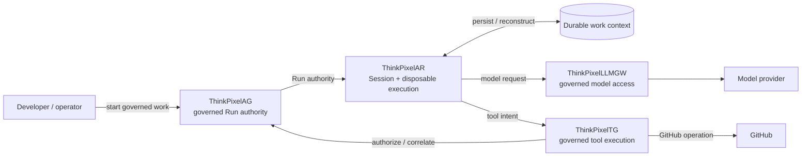
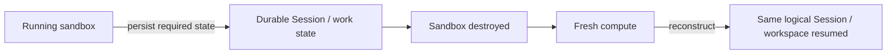
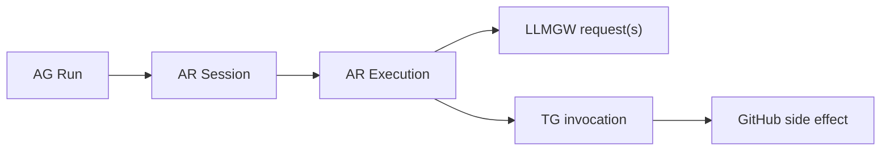

# ThinkPixel Development Alignment

This document defines the **current cross-repository development objective** for ThinkPixel.

It answers one question:

> **What should the platform prove next?**

It controls development priority, not architectural truth.

Accepted ADRs, published contracts, security boundaries, and component ownership remain authoritative within their respective scopes.

For permanent platform context, see the root [`README.md`](../../README.md).

For component metadata, see [`catalog/components.yaml`](../../catalog/components.yaml).

For release and compatibility semantics, see [`releases/README.md`](../../releases/README.md).

---

## Current objective

Build one reproducible vertical slice demonstrating that ThinkPixel can run a useful coding agent while keeping **authority, long-lived credentials, durable work, and governed side effects outside disposable agent compute**.

The target scenario is:

> Give an approved Codex agent a GitHub repository, execute it inside isolated disposable compute, route model access through ThinkPixelLLMGW, route a visible GitHub operation through ThinkPixelTG, destroy the execution sandbox completely, reconstruct execution on fresh compute, and continue the same logical Session/workspace under ThinkPixelAG authority.

The objective is not broad feature coverage.

The objective is to make the architecture **observable through a real working system**.

---

## What the vertical slice must prove

The scenario should visibly demonstrate six properties:

1. **Agents are untrusted.**
2. **Authority is external.**
3. **Credentials are external.**
4. **Compute is disposable.**
5. **State is durable.**
6. **Side effects are governed.**

A shortcut is acceptable only if these claims remain true.

---

## Golden path

Recovery must be real:

The original execution environment must actually disappear.

Restarting the same process or merely simulating sandbox loss does not prove the intended property.

---

## Critical path

### ThinkPixelAR — primary implementation path

AR should receive the majority of implementation effort until the complete scenario works.

The next meaningful capabilities are:

* start and supervise a real Codex harness through the intended runtime path;
* execute Codex inside the actual sandbox boundary;
* create a durable logical Session and concrete Execution;
* expose enough runtime events to understand what is happening;
* persist the state required for continuation;
* deliberately destroy the execution sandbox;
* create replacement compute;
* reconstruct execution;
* resume the same logical Session/workspace;
* consume AG-provided authority;
* consume governed model and tool access rather than embedding privileged credentials.

Do not delay this work for unrelated AR completeness.

---

### ThinkPixelAG — integrate, do not broaden

AG supplies authority for the current scenario.

Implement only integration work needed to provide:

* governed Run authority;
* resource/runtime authorization;
* cancellation and revocation;
* leases or fencing where required for correctness;
* authorization consumed by AR and TG.

The current objective is to **use AG as authority**, not enlarge AG.

---

### ThinkPixelLLMGW — support the Codex wire path

The goal is:

> one real Codex model interaction routed through LLMGW with observable identity and accounting.

The golden path must support the subset of the **OpenAI Responses API and SSE streaming semantics actually exercised by the pinned Codex version used by the demo**.

Implement the smallest compatible subset required by that pinned client.

Do not turn this milestone into a complete Responses API implementation or exhaustive provider-compatibility effort.

The important proof is:

* Codex makes a real request;
* the request traverses LLMGW;
* provider credentials remain outside the agent sandbox;
* request identity/accounting is observable;
* streamed behavior required by Codex works correctly.

---

### ThinkPixelTG — prove one governed side effect

Route at least one obvious GitHub side effect through TG.

Prefer an operation that is easy to understand while observing the scenario, such as:

* posting a PR review comment;
* creating or updating a review;
* another bounded GitHub operation with a clearly visible result.

The important properties are:

* the agent requests the operation;
* TG performs the governed operation;
* the agent does not receive the long-lived GitHub credential;
* the operation can be correlated with platform authority and stable identities.

The complexity of the GitHub operation itself is not important.

---

### Durable Workspace behavior — minimum necessary

The first milestone does not require complete ThinkPixelWS product maturity.

Use the smallest replaceable implementation necessary to prove:

* persistent work context;
* survival across sandbox destruction;
* reconstruction on replacement compute;
* safe writer behavior required by the demonstrated flow.

Do not couple AR permanently to a temporary persistence implementation.

The boundary should remain replaceable by the intended ThinkPixelWS implementation.

---

## Not on the critical path

The following components remain valid parts of the wider architecture but should not block this milestone.

### ThinkPixelMP

Dynamic marketplace resolution is not required.

Pin immutable runtime and agent artifacts directly where necessary.

### ThinkPixelMEM

Long-term learned memory is not required for the coding-agent recovery scenario.

Do not add memory merely because an agent platform is expected to have it.

### ThinkPixelGR

Guardrail integration is not required unless a concrete operation in the active path needs it.

Integrate guardrails around real traffic, not hypothetical future traffic.

### ThinkPixelXP

Experimentation and evaluation should follow once there is a stable execution path whose variants and outcomes are meaningful to compare.

### ThinkPixelInfra

The existing search/RAG implementation is adjacent to the current runtime milestone.

Do not force it into the golden path until a concrete use case establishes its platform boundary.

---

## Priority order

When deciding what to work on next:

### P0 — Make the path execute

Fix anything preventing the complete scenario from running.

Examples:

* Codex cannot start;
* the sandbox cannot be created;
* Session/Execution lifecycle cannot proceed;
* Codex model traffic cannot traverse LLMGW;
* the GitHub operation cannot traverse TG;
* durable state does not survive replacement;
* replacement execution cannot resume;
* AG authority cannot be consumed correctly.

### P1 — Make the path truthful

Fix anything that makes the architectural demonstration misleading.

Examples:

* long-lived credentials enter the sandbox;
* the agent can expand its own authority;
* durable state actually depends on disposable compute;
* the demonstrated GitHub operation bypasses TG;
* model traffic bypasses LLMGW;
* stale or fenced execution can continue performing governed actions;
* recovery creates a new logical Session rather than continuing the existing one.

A demo that cheats is worse than no demo.

### P2 — Make the path reproducible

Make it possible for another developer to run the same scenario reliably.

Examples:

* pinned Codex/runtime versions;
* deterministic setup and reset;
* a sample repository and task;
* concise configuration;
* useful diagnostics;
* scripted or documented execution.

### P3 — Package the milestone

Once the path works reproducibly:

* stop broad feature development;
* pin exact participating revisions and artifacts;
* record known limitations;
* document reproduction instructions;
* create the appropriate platform release manifest.

Only then broaden the platform.

---

## Evidence

The demo should make the important identities and boundaries observable.

At minimum, an observer should be able to correlate:

Perfect distributed tracing is not required.

Stable identifiers plus readable structured logs or equivalent evidence are sufficient for the first milestone.

Do not delay the scenario to build an observability platform.

---

## Definition of success

The milestone is reached when another developer can reproduce and observe this sequence:

1. AG authorizes a governed Run.
2. AR creates the logical Session and starts Codex inside isolated disposable compute.
3. Codex receives a real repository task and performs useful work.
4. Codex model traffic flows through LLMGW.
5. The Codex wire path required by the pinned client works through LLMGW, including required Responses/SSE behavior.
6. A visible GitHub side effect flows through TG.
7. The agent never receives the long-lived GitHub credential used for that operation.
8. Work required for continuation persists outside the disposable sandbox.
9. The sandbox is deliberately destroyed.
10. Fresh compute is created.
11. The same logical Session/workspace is reconstructed and continues.
12. The relevant operations can be correlated through stable platform identities.
13. The complete scenario can be reproduced from documented inputs.

Optional but desirable:

14. AG cancellation or revocation prevents further governed work.

Once items 1–13 work reproducibly, **stop**.

Package the working combination before adding another platform capability.

---

## What this milestone does not claim

Success does not imply:

* every ThinkPixel component is integrated;
* production qualification;
* high availability;
* multi-region operation;
* exhaustive security testing;
* every model provider is qualified;
* every agent harness is supported;
* complete Workspace functionality;
* full Marketplace integration;
* comprehensive guardrails;
* long-term memory;
* experimentation infrastructure;
* production-scale performance.

Those claims require separate evidence.

This milestone proves something narrower:

> ThinkPixel can govern a useful agent across real model access, real tool access, disposable execution, durable work, and recovery without making the agent itself authoritative.

---

## Guiding rule

When choosing between:

> making one repository more theoretically complete

and:

> making the current ThinkPixel vertical slice work through the correct boundaries,

prefer the vertical slice.

Do not take a shortcut that invalidates the authority, credential, ownership, or isolation properties the scenario exists to demonstrate.
