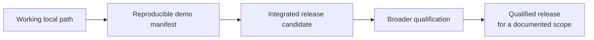

# ThinkPixel Platform Releases

ThinkPixel components are independently developed and independently versioned.

A ThinkPixel **platform release** therefore does not mean that every repository shares a common version number.

A platform release is a **tested bill of materials plus verified behavior**.

It records an exact combination of component revisions, runtime assumptions, artifacts, known limitations, and end-to-end scenarios that have actually been exercised together.

---

## Why platform manifests exist

ThinkPixel deliberately consists of independently deployable components.

That creates an important distinction:

> **Component version does not imply platform compatibility.**

For example, the existence of:

```text
ThinkPixelAG      v0.1.0-rc.2
ThinkPixelAR      <some revision>
ThinkPixelLLMGW   <some revision>
ThinkPixelTG      <some revision>
```

does not by itself mean that those revisions form a tested system.

A platform release manifest answers a different question:

> Which exact revisions have been exercised together, under which conditions, and what behavior was actually verified?

If a combination is not represented by a platform release or other explicit compatibility evidence, compatibility should be treated as **unknown**, not assumed.

---

## Release philosophy

ThinkPixel releases should prefer narrow claims backed by working evidence over broad claims backed by architectural intent.

For the current phase, a release candidate does **not** mean:

> production-ready for every intended environment and configuration.

It means:

> a coherent and reproducible implementation of a clearly defined capability, with its participating revisions pinned, its limitations documented, and its demonstrated path working reliably enough for another developer to exercise.

A narrow release candidate is useful.

An expansive release candidate that cannot be reproduced is not.

---

## Initial release target

The first integrated ThinkPixel release should prove the governed coding-agent recovery scenario.

The target behavior is:

1. ThinkPixelAG authorizes a governed Run.
2. ThinkPixelAR starts a real Codex harness in isolated compute.
3. Model access passes through ThinkPixelLLMGW.
4. Durable work survives independently of the sandbox.
5. A visible GitHub side effect passes through ThinkPixelTG.
6. The long-lived GitHub credential remains outside the agent sandbox.
7. The original execution sandbox is destroyed.
8. Replacement compute is created.
9. The same logical Session/workspace is resumed under the same governing authority.
10. Evidence allows the important operations to be associated with stable platform identities.

The first manifest does not need to include every ThinkPixel component.

---

## Release levels

ThinkPixel currently recognizes three useful platform-level release states.

### `demo`

A reproducible development snapshot demonstrating a specific end-to-end capability.

A demo release may:

* depend on narrow environment assumptions;
* use temporary adapters;
* require developer-oriented setup;
* support only one provider, harness, connector, or runtime configuration.

It must still pin the code and configuration needed to reproduce the demonstrated behavior.

### `rc`

A release candidate represents a deliberately scoped platform capability that is intended to be exercised by people other than its original developer.

An RC should have:

* immutable component revisions;
* documented setup requirements;
* a repeatable deployment or startup path;
* a repeatable verification scenario;
* explicit known limitations;
* meaningful diagnostics;
* no known violation of the security boundaries claimed by the demonstrated scenario.

`rc` does **not** imply general production qualification.

### `qualified`

A qualified platform release has passed an explicitly documented qualification scope.

The qualification document must say what was tested rather than allowing the word `qualified` to imply universal suitability.

Qualification may define, for example:

* supported deployment topology;
* Kubernetes/runtime versions;
* model providers;
* agent harnesses;
* connectors;
* storage systems;
* upgrade paths;
* failure/recovery tests;
* security tests;
* load or scalability bounds.

A release is qualified only for the scope that was actually evaluated.

---

## Directory layout

Platform release manifests live in this directory.

For example:

```text
releases/
├── README.md
├── demo-0.1.yaml
├── 0.1.0-rc.1.yaml
└── 0.1.0.yaml
```

The exact naming convention may evolve before the first platform RC.

Once external releases exist, manifest naming should become stable.

---

## Manifest requirements

Every platform release manifest should answer six questions:

### 1. What is this release?

It must have a stable release identifier and release level.

### 2. Exactly what code participated?

Every participating ThinkPixel component must be pinned to an immutable Git commit.

A human-friendly tag may additionally be recorded.

Branch names such as `main` are not valid release pins.

### 3. What other immutable artifacts participated?

Where applicable, record immutable identities for:

* container images;
* agent runtimes;
* harness bundles;
* Skills;
* MCP servers;
* deployment packages;
* policy bundles;
* configuration bundles.

Prefer content digests where the underlying artifact system supports them.

### 4. In what environment was it verified?

Document material assumptions such as:

* orchestration platform;
* sandbox/runtime implementation;
* persistence implementation;
* harness;
* model-provider route;
* tool connector;
* required external infrastructure.

### 5. What behavior was actually verified?

A manifest should identify concrete scenarios with an explicit result.

Architectural intentions do not count as verified scenarios.

### 6. What is not being claimed?

Every release should list known limitations and important untested areas.

The limitations section is part of the release, not an embarrassment to hide.

---

## Example manifest

The following is illustrative. It is **not** itself a release.

```yaml
schema_version: "1"

release:
  id: "0.1.0-rc.1"
  level: rc
  date: "YYYY-MM-DD"

  description: >-
    First reproducible governed coding-agent recovery vertical slice.

components:
  ag:
    repository: bdobrica/ThinkPixelAG
    commit: "<full-git-commit-sha>"
    tag: "v0.1.0-rc.2"

  ar:
    repository: bdobrica/ThinkPixelAR
    commit: "<full-git-commit-sha>"
    tag: null

  llmgw:
    repository: bdobrica/ThinkPixelLLMGW
    commit: "<full-git-commit-sha>"
    tag: "<tag-if-present>"

  tg:
    repository: bdobrica/ThinkPixelTG
    commit: "<full-git-commit-sha>"
    tag: "<tag-if-present>"

  ws:
    repository: bdobrica/ThinkPixelWS
    commit: null
    tag: null
    participation: >-
      Full ThinkPixelWS service not required by this release. The release uses
      the durable workspace adapter identified below.

artifacts:
  agent_runtime:
    name: "<runtime-name>"
    digest: "<immutable-digest>"

  workspace_adapter:
    name: "<adapter-name>"
    digest: "<immutable-digest>"

  deployment:
    name: "<deployment-bundle>"
    digest: "<immutable-digest>"

environment:
  harness:
    name: codex
    version: "<pinned-version-or-digest>"

  orchestration:
    platform: kubernetes
    version: "<tested-version>"

  sandbox:
    implementation: kata
    version: "<tested-version>"

  model_route:
    gateway: thinkpixel-llmgw
    provider: "<provider>"
    model: "<model-or-route>"

  tool_route:
    gateway: thinkpixel-tg
    connector: github

scenarios:
  - id: governed-coding-agent-recovery
    result: verified

    verifies:
      - governed_run_authority
      - isolated_agent_execution
      - model_access_through_llmgw
      - github_side_effect_through_tg
      - downstream_credential_not_exposed_to_agent
      - durable_work_survives_sandbox_destruction
      - replacement_compute_created
      - logical_session_resumed
      - observable_cross_component_identity

    evidence:
      reproduction: "<path-to-reproduction-instructions>"
      results: "<path-to-test-or-demo-evidence>"

limitations:
  - "Only the Codex harness is covered by this release."
  - "Only one sandbox/runtime configuration is covered."
  - "Only the documented model route is covered."
  - "Only the GitHub tool connector is covered."
  - "The complete ThinkPixel platform is not production-qualified."
  - "Components not listed in this manifest are outside this release scope."
```

---

## Immutable pins

Release manifests should prefer the strongest immutable identity available.

For Git repositories, record the full commit SHA.

A tag may be included for readability, but the tag should not be the only identity used by a platform release manifest.

For OCI images and similar packaged artifacts, prefer content digests rather than mutable tags such as:

```text
latest
main
dev
rc
```

A release should remain reconstructable even after normal development has continued.

---

## Component participation

Not every component needs to participate in every platform release.

A manifest may deliberately exclude components that are:

* unnecessary to the demonstrated capability;
* not yet integrated;
* being replaced temporarily by a narrow adapter;
* independently usable but outside the release scope.

Omission is preferable to pretending that a component was exercised when it was not.

For the first governed coding-agent release, the expected core participation is:

```text
ThinkPixelAG
ThinkPixelAR
ThinkPixelLLMGW
ThinkPixelTG
```

with only the smallest durable Workspace capability necessary to prove recovery.

ThinkPixelMEM, ThinkPixelMP, ThinkPixelGR, ThinkPixelXP, and the current ThinkPixelInfra/Search lineage should not be added merely to make the release appear more complete.

---

## Compatibility

A platform release manifest defines a **known-good tested set**.

It does not define every compatible set.

Given two releases:

```text
0.1.0-rc.1
0.1.0-rc.2
```

a component revision appearing in `rc.2` should not automatically be assumed compatible with the remaining component revisions from `rc.1`.

Compatibility outside a verified manifest may exist, but it remains unqualified until demonstrated.

Over time, ThinkPixel may publish broader compatibility constraints where the evidence supports doing so.

Until then, exact tested combinations are more useful than optimistic version ranges.

---

## Releasing

Before publishing an integrated platform release:

1. Pin all participating source revisions and artifacts.
2. Recreate the target environment from the documented inputs.
3. Execute the complete release verification scenario.
4. Capture enough evidence to diagnose failures and confirm the intended boundaries.
5. Verify that no long-lived credential expected to remain external is present inside agent execution.
6. Destroy the execution sandbox during the recovery scenario rather than simulating its loss.
7. Verify continuation on replacement compute.
8. Record known limitations.
9. Commit the final release manifest.
10. Tag the umbrella repository with the corresponding platform release identifier.

Do not publish a platform RC merely because participating component repositories individually have RC tags.

The integration itself is what is being released.

---

## Promotion

Release promotion should be evidence-driven.

A typical progression is:



Promotion should broaden claims only after the corresponding behavior has actually been tested.

The goal is not to reach `1.0` quickly.

The goal is for a ThinkPixel release identifier to tell another developer exactly what they can reproduce and exactly what has — and has not — been demonstrated.
